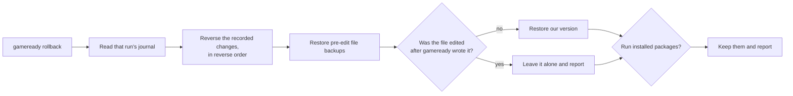

# gameready

A Linux tool that tunes your system for gaming, and undoes it when you are
done. One command finds your Steam games, asks what you want, applies the
tuning, verifies it worked, and keeps a receipt so `gameready rollback` puts
everything back.

It targets the three things that ruin a session: games that crash on launch,
stutter, and frame-time hitches. For the GPU it raises the shader cache so games
stop recompiling shaders mid-run, and adds an in-game FPS and GPU monitor. Every
change is reversible.

## What it fixes

| What it fixes | Tuning | How |
|---|---|---|
| **Graphics & shaders** | Shader cache | Raises the GPU's shader cache ceiling so games stop recompiling shaders, the classic mid-game stutter |
| | FPS + GPU monitor | Installs mangohud so you can see FPS, GPU and CPU usage, temperatures, and frame times in game |
| | Proton-GE | Ships a newer Vulkan stack (DXVK, vkd3d-proton) so Windows games run with fewer graphics issues |
| **CPU** | CPU speed | Keeps the CPU at full speed while you play |
| | Split-lock | Disables a CPU penalty that crawls some games |
| | Game boost | Raises game priority and CPU speed while the game runs, then restores |
| **Memory & storage** | Memory map limit | Raises the kernel's memory-map limit so memory-hungry games start instead of crashing on launch |
| | Memory latency | Retunes the memory manager for low latency instead of server throughput |
| | Swap | Uses zram for swap instead of starving RAM |
| | I/O scheduler | Matches each disk to the right I/O scheduler, fewer hitches |
| **Steam & Proton** | Launch options | Adds the boost and overlay to each game's launch |
| | Proton version | Pins each game to the Proton build its profile asks for |
| | Conflict check | Tells you if a power daemon is fighting the boost |

`gameready init` applies the gamemode boost to every game you pick, and uses a
tuned profile (launch options, Proton version) where one exists.
`gameready explain` lists every tuning and what it would do on your machine.

## It won't touch

gameready does not install kernels, edit `/etc/default/grub`, change GPU
drivers, or add kernel command line parameters. No overclocking, no bootloader
edits, nothing that risks an unbootable system. The GPU fix it does make, the
shader cache ceiling, is a config file, not a driver change.

`gameready doctor` also reports three settings it deliberately does not apply,
and flags them if they are already on your system:

| Setting | Why it is not applied |
|---|---|
| `mitigations=off` | Measured gaming gain is around 1% on CPUs from 2020 onward, against Spectre and Meltdown exposure |
| `vm.swappiness=1` | Works against zram, which most distros now enable by default |
| `kernel.sched_latency_ns` and related | Removed in kernel 6.6 with EEVDF; writing them to `/etc/sysctl.d` does nothing |

## Quick start

```bash
curl -fsSL https://andyngdz.github.io/gameready/install.sh | sh
gameready init
```

`init` finds your installed Steam games, asks which to set up and whether you
want an FPS overlay, then applies the tunings. It asks for your sudo password
once, and only if a tuning needs root. Change your mind later: `gameready
rollback`.

The installer also drops in a tray indicator, searchable as "Gameready Tray",
which shows which tunings are in place and turns green while a configured game
runs. It starts right after install and at each login.

## How it works

gameready checks your system before it changes anything. Each tuning decides
whether it applies, you confirm the plan, and only then does it apply. Every
change is written to a journal before it happens, each tuning is verified by
reading the system back, and a tuning that fails verification is rolled back on
the spot.

```mermaid
flowchart LR
    Start["gameready init"] --> Probe["Probe every tuning<br/>read-only, changes nothing"]
    Probe --> Sorted{"Each tuning is"}
    Sorted -->|"would apply"| Any{"Any to apply?"}
    Sorted -->|"already in place / not applicable / conflict / unknown"| Skip["Skipped - nothing to do"]
    Any -->|no| Exit3["Exit 3 - nothing to apply"]
    Any -->|yes| Plan["Plan screen:<br/>confirm what to apply"]
    Plan --> InstallQ{"Packages to install?"}
    InstallQ -->|yes| Pkg["Own consent prompt"]
    InstallQ -->|no| DryQ
    Pkg --> DryQ
    DryQ{"Dry run?"}
    DryQ -->|yes| PrintPlan["Print the plan<br/>change nothing"]
    PrintPlan --> Exit0["Exit 0"]
    DryQ -->|no| RootQ{"Needs root?"}
    RootQ -->|yes| Sudo["One sudo password prompt"]
    RootQ -->|no| Journal["Open the journal<br/>record RunBegin"]
    Sudo --> Journal
    Journal --> Apply["Each chosen tuning:<br/>apply it"]
    Apply --> J["Changes journaled and fsync'd<br/>BEFORE they happen"]
    J --> Verify{"Verify by<br/>reading the system back"}
    Verify -->|passes| Applied["Mark applied"]
    Verify -->|fails| StepRollback["Roll back that tuning's<br/>own recorded changes"]
    Applied --> More{"More tunings?"}
    StepRollback --> More
    More -->|yes| Apply
    More -->|no| Report["Report the summary"]
    Report --> Exit0
    Report --> Exit1["Exit 1 - a tuning failed"]
```



`--dry-run` short-circuits the whole flow: it prints the plan and changes
nothing. Exit codes: 0 clean, 1 a tuning failed, 2 bad arguments, 3 nothing to
apply.

## Undo is the whole point

Every run writes a journal and backs up every file it edits. `rollback` undoes
a run in reverse order, restores the backups, and refuses to touch a file you
edited by hand after gameready wrote it.



Packages installed during a run stay installed. Uninstalling is not the inverse
of installing: dependency cascades, leftover configuration, and other users of
the package all differ. Rollback names what it installed so you can remove it
yourself, and gameready says so before it installs anything.

## Your commands

| Command | What it does |
|---|---|
| `gameready init` | Find your games, ask what you want, apply it |
| `gameready rollback` | Put everything back. Any run, any time |
| `gameready doctor` | What your machine is, and what each tuning would do |
| `gameready explain [step]` | One tuning: why it exists, what it would change here |
| `gameready list-games` | The game profiles gameready can see, and where each came from |
| `gameready apply` | Apply, or one tuning with `--step <id>` |
| `gameready selftest` | Apply, verify, revert, verify. Proves a tuning works |

`init` and `apply` accept `--dry-run` (work out the plan, change nothing) and
`--yes` (take every default, install without asking). `init` also takes
`--fps-overlay` to pre-answer the overlay question. `rollback` takes
`--run <id>` to target one run. `selftest` takes `--step <id>` to prove one
tuning. `--json` prints the run report as JSON on `init` and `apply`.

## Install options

The one-liner downloads the static x86_64 binary from the
[latest release](https://github.com/andyngdz/gameready/releases/latest), checks
it against the published sha256, and installs it to `~/.local/bin`. Read
[docs/install.sh](docs/install.sh) before piping it to a shell. Two variables
change what it does:

```bash
GAMEREADY_VERSION=v0.2.5 sh -c "$(curl -fsSL https://andyngdz.github.io/gameready/install.sh)"
GAMEREADY_INSTALL_DIR=/usr/local/bin sh -c "$(curl -fsSL https://andyngdz.github.io/gameready/install.sh)"
```

A directory you cannot write to is installed into through `sudo`. Set
`GAMEREADY_NO_TRAY` to skip the tray indicator.

To skip the script, download the asset and its checksum by hand:

```bash
curl -LO https://github.com/andyngdz/gameready/releases/latest/download/gameready-linux-x86_64
chmod +x gameready-linux-x86_64
sudo mv gameready-linux-x86_64 /usr/local/bin/gameready
```

Or build from source (needs Rust 1.90 or newer):

```bash
git clone https://github.com/andyngdz/gameready
cd gameready
cargo build --release
./target/release/gameready --help
```

Arch users can build from the [PKGBUILD](pkg/arch/PKGBUILD).

## Supported systems

Arch (pacman), Debian and Ubuntu (apt), Fedora (dnf). Steam game detection.

## For contributors

See [TESTING.md](TESTING.md) for what each test layer covers and how to work
with snapshots, and [CONTRIBUTING.md](CONTRIBUTING.md) for how to add a step or
a game profile.

```bash
cargo test                                       # unit and snapshot tests
cargo test --features docker-tests -- --ignored  # per-distro containers, slow
gameready selftest                               # real system, real rollback
```

## Milestones

All planned milestones (M1 through M7) are complete: engine and journal,
system detection, package and service steps, Steam profiles, Proton-GE, the
full `init` flow, and the remaining system tunings.

## License

GPL-3.0-or-later. See [LICENSE](LICENSE).
